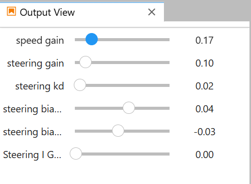

### 期中考專案總結

---

#### 模型設定

- 模型架構：ResNet-18
- 原始影像大小：
  - **224x224** (原始版本)
  - **224x130** (改進版本)
- 訓練目標：車道辨識，預測路徑落點
- 平均辨識速率：50ms~110ms (提升版本) / 150ms~200ms (原始版本)
- 相機FPS：
  - 5fps（224x224 原始版本）
  - 9~13fps（224x130 改進版本）
- 參數
- 
---

#### 訓練資料集與結果

| 版本名稱                    | 描述                                                   | 資料集                      |
|-----------------------------|--------------------------------------------------------|-----------------------------|
| **best_steering_model_xy.pth** | 第一個成功版本，使用初始的 1100 資料集進行訓練            | [1100](Midterm/Train/1100)          |
| **resnet18_1600.pth**       | 新增樣本數以涵蓋更多角度                                | [1600](Midterm/Train/1600)          |
| **resnet18_1600_v2.pth**    | 重新標記資料以避免過於極端的標記，減少誤判                | [1600](Midterm/Train/1600)          |
| **resnet18_1600_v3.pth**    | 增加 100 張靠左直線空白區域樣本，增強對直線的辨識         | [1600](Midterm/Train/1600)          |
| **resnet18_1600_v4.pth**    | 增加 300 張靠右直線空白區域樣本，加強模型在右側車道的穩定性 | [1600](Midterm/Train/1600)          |

---

#### 運行環境

- **平台**：JetBot (依賴相機)
- **訓練文件**： [TrainRestnet_TensorRT.ipynb](Midterm/Train/TrainRestnet_TensorRT.ipynb)
- **運行程式**：
  - **道路跟隨程式 (原始影像)**： [NormalRoadFollowing.ipynb](Midterm/Result/ipynb/NormalRoadFollowing.ipynb)
  - **道路跟隨程式 (截去影像上部)**： [NormalRoadFollowing-CutImage.ipynb](Midterm/Result/ipynb/NormalRoadFollowing-CutImage.ipynb)
  - **預測落點並顯示**： 
    - 原始影像：[Predict (1).ipynb](Result/ipynb/Predict%20(1).ipynb)
    - 截去影像上部：[PredictCutImage.ipynb](Result/ipynb/PredictCutImage.ipynb)
  - **測試相機處理速度**：
    - 原始影像：[TestExcuteSpeed.ipynb](Result/ipynb/TestExcuteSpeed.ipynb)
    - 截去影像上部：[TestExcuteSpeed-CutImage.ipynb](Result/ipynb/TestExcuteSpeed-CutImage.ipynb)

---

#### 改進點與優化

- **平視拍攝**：
  - 拍攝角度較接近人眼平視，避免僅依賴路面特徵，有助於提前預測動向。
  - 平視需更大量樣本以忽略上半部分背景，否則易受雜訊影響。
- **影像裁剪**：
  - 去除影像上半部分 40% 的資料，避免背景干擾，僅保留車道特徵，有助於提高模型穩定性。
  - 對 ResNet-18 進行輸入適配 (224x130) 訓練，顯著減少辨識延遲。

---

#### 影片演示

- [示例影片 1](https://youtube.com/shorts/N_F7avbfFk4?feature=share)
- [示例影片 2](https://youtube.com/shorts/S1-lvRKiw_E?feature=share)
- [示例影片 3](https://youtube.com/shorts/tDnq7fe2e6c?feature=share)

---

#### 最終訓練模型

- 原始版本：[lane_detection_model.pth](Result/lane_detection_model.pth)
- 改進版本：[best_steering_model_xy.pth](Result/best_steering_model_xy.pth)
- 其他版本：
  - [resnet18_1600.pth](Result/resnet18_1600.pth)
  - [resnet18_1600_v2.pth](Result/resnet18_1600_v2.pth)
  - [resnet18_1600_v3.pth](Result/resnet18_1600_v3.pth)
  - [resnet18_1600_v4.pth](Result/resnet18_1600_v4.pth)

---
